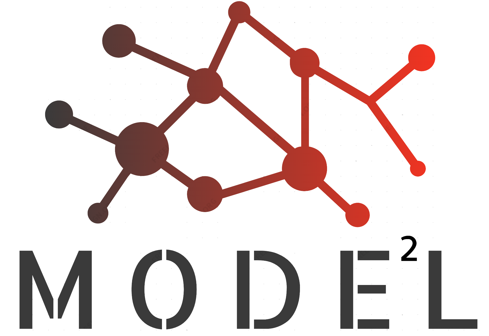

<div class="social-icons section">
  Page <span class="page">1</span> of <span class="topage"></span>
  <div style="float: right">
    <a href="https://www.linkedin.com/in/cheng-chen-1223b583" target="_blank">
      
    </a>
  </div>
</div>

## Cheng's Bio

Cheng Chen is a second-year Ph.D. student at the University of Georgia. He received his bachelor’s at Central College of BUPT in Beijing and a master’s degree at Florida Institute of Technology. His doctoral research interest is in using heuristic methods to study and understand the evolution of requirement networks in industrial system design. He also studies the impact of Artificial Intelligence on engineering design education.

### Academic Background
<dl>
  <dd>B.S. in Mechanical Engineering, Century College of BUPT, 2012</dd>
  <dd>M.Sc. in Aerospace Engineering, Florida Institute of Technology, 2016</dd>
  <dd>Ph.D. in Mechanical Engineering, (in progress)</dd>
</dl>

### Research Interests
<ul>
  <li>Design Automation</li>
  <li>Requirement Management</li>
  <li>Spray Optimization</li>
  <li>Engineering Education</li>
</ul> 

### Publications
Chen, C., 2016. A Maximum Entropy Approach to Identifying Important Statistical Moments to Best-Represent Spray Distribution Data. <a href="https://repository.lib.fit.edu/bitstream/handle/11141/1097/CHEN-THESIS.pdf?sequence=1">(PDF)</a>

Chen, C., & Olajoyegbe, T. O., & Morkos, B. (2020, June), The Imminent Educational Paradigm Shift: How Artificial Intelligence will Reframe how we Educate the Next Generation of Engineering Designers  Paper presented at 2020 ASEE Virtual Annual Conference Content Access, Virtual On line . 10.18260/1-2--35326. <a href="https://peer.asee.org/the-imminent-educational-paradigm-shift-how-artificial-intelligence-will-reframe-how-we-educate-the-next-generation-of-engineering-designers">(PDF)</a>

<!--
```markdown
Syntax highlighted code block

# Header 1
## Header 2
### Header 3

- Bulleted
- List

1. Numbered
2. List
 
**Bold** and _Italic_ and `Code` text

[Link](url) and 
```
For more details see [GitHub Flavored Markdown](https://guides.github.com/features/mastering-markdown/).
### Jekyll Themes
Your Pages site will use the layout and styles from the Jekyll theme you have selected in your [repository settings](https://github.com/ChengC2019/Webpage/settings). The name of this theme is saved in the Jekyll `_config.yml` configuration file.

### Support or Contact
Having trouble with Pages? Check out our [documentation](https://help.github.com/categories/github-pages-basics/) or [contact support](https://github.com/contact) and we’ll help you sort it out.
-->
